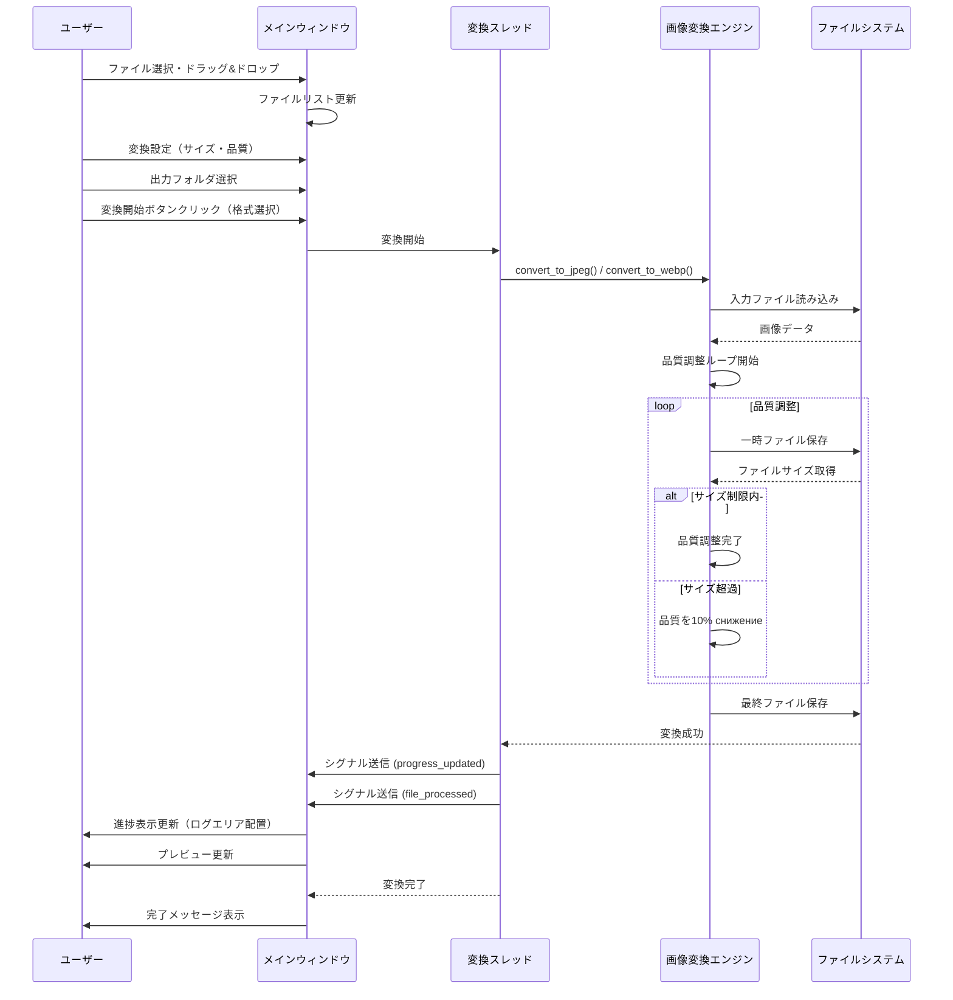

# 高品質画像変換ツール v2.1.3

Windows用のモダンGUIアプリケーションです。PNGファイルを指定されたサイズ制限内で最高品質JPEG/WebPに変換できます。ダークモード対応の洗練されたインターフェースを備えています。

## 🎯 主な機能

- **Dual Format Support**: JPEG、WebPの選択式変換
- **高品質変換**: OpenCVとPillowを使用した最高品質の画像変換
- **サイズ制限機能**: 1-10MBの制限内で最適品質を自動調整
- **ドラッグ&ドロップ対応**: 広域エリアへの簡単なファイル追加（日本語パス対応）
- **プレビュー機能**: 変換前後の画像をリアルタイム比較
- **モダンUI**: ダークモード、黒色出力パス表示、見やすい進捗ログ

## � システムアーキテクチャ

### コンポーネント図

```mermaid
graph TB
    A[メインアプリケーション main.py] --> B[メインウィンドウ MainWindow]
    B --> C[ファイル選択コンポーネント]
    B --> D[プレビューウィジェット PreviewWidget]
    B --> E[変換設定 UI]
    B --> F[ログ表示 UI]
    
    C --> G[ドラッグ&ドロップ エリア 360px]
    C --> H[ファイル選択ボタン]
    C --> I[フォルダ選択ボタン]
    C --> J[クリアボタン]
    
    E --> K[品質設定 Slider]
    E --> L[サイズ制限 Slider]
    E --> M[出力フォルダ選択（黒色表示）]
    E --> N[JPEG変換ボタン]
    E --> O[WebP変換ボタン]
    
    B --> P[変換スレッド ConversionThread]
    P --> Q[画像変換エンジン ImageConverter]
    
    Q --> R[OpenCV 画像処理]
    Q --> S[Pillow JPEG/WebP出力]
    Q --> T[品質調整アルゴリズム]
    
    style A fill:#e1f5fe
    style P fill:#f3e5f5
    style Q fill:#e8f5e8
    style B fill:#263238
```

### 処理シーケンス図

## �🛠️ 技術スタック

- **Python 3.10+**: メイン開発言語
- **CustomTkinter**: モダンGUIフレームワーク
- **OpenCV & Pillow**: 高品質画像処理エンジン
- **windnd**: Windowsネイティブのドラッグ&ドロップ対応

## 🚀 使い方

1. **ファイル選択**: PNGファイルをドラッグ＆ドロップ、またはボタンで選択
2. **変換設定**:
   - **最大サイズ**: 1-10MB
   - **品質**: 1-100
   - **出力先**: 「参照」ボタンで保存先を指定
3. **変換実行**: 「JPEG形式」または「WebP形式」ボタンをクリック
4. **結果確認**: プレビューで変換結果を確認

## 🔄 バージョン履歴

### v2.1.3 (2025-12-30)
- **安定性向上**
  - **出力先参照ボタンの修正**: パスが長くなってもボタンが常に表示されるようレイアウトを改善
  - **起動エラーの解消**: 一部環境での初期化エラー (TypeError) を修正
  - **ファイル整合性の確保**: コアファイルの完全再構築によるバグ排除

### v2.1.2 (2025-12-30)
- **バグ修正**
  - ドラッグ&ドロップ時のプレビュー非表示バグを修正
  - 日本語を含むファイルパスでのエンコーディングエラーを修正 (mbcs対応)
  - OpenCVの日本語パス非対応問題を解決
- **安定性向上**
  - ファイル破損箇所の修復

### v2.1.1 (2025-12-30)
- **Dual Format Support 実装**: JPEG/WebP変換機能
- **UI改良**: 出力フォルダの黒色表示、ログエリアの改善

### v2.0.0 (2025-12-30)
- **UI 大改善**: ダークモード、スクロール機能、レイアウト刷新

## 📋 必要環境

- **OS**: Windows 10/11 (64-bit)
- **Python**: 3.10 以上
- **依存ライブラリ**: `requirements.txt` 参照

## 📞 開発者情報

- **バージョン**: v2.1.3
- **最終更新**: 2025-12-30
- **ライセンス**: MIT License

---
**✨ 高品質画像変換ツールで、より効率的な画像処理をお楽しみください！ ✨**
