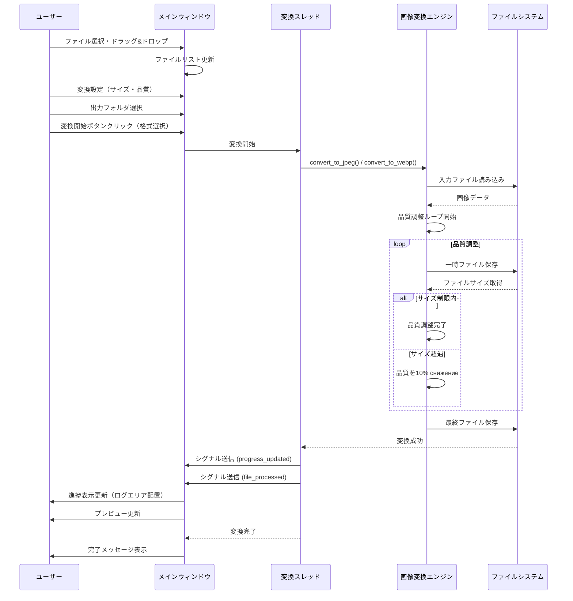
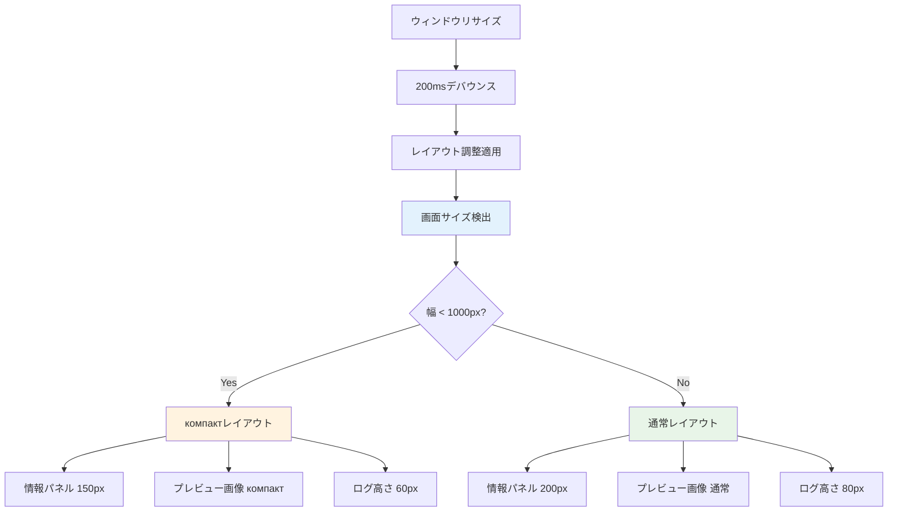
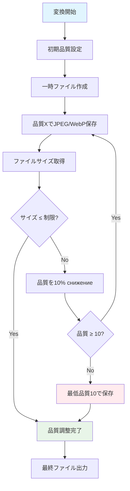
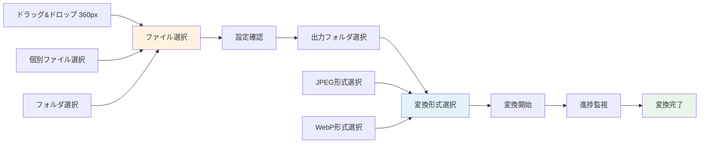

# 高品質画像変換ツール v2.1.2

Windows用のモダンGUIアプリケーションです。PNGファイルを指定されたサイズ制限内で最高品質JPEG/WebPに変換できます。ダークモード対応の洗練されたインターフェースを備えています。

## 🎯 主な機能

- **高品質JPEG/WebP変換**: OpenCVとPillowを使用した最高品質の画像変換
- **Dual Format Support**: JPEG、WebPの選択式変換（ボタン方式）
- **サイズ制限機能**: 1-10MBの制限内で最適品質を自動調整
- **ドラッグ&ドロップ対応**: 簡単ファイル選択（360px広域エリア）
- **プレビュー機能**: 変換前後の画像をリアルタイムで表示（ компакт 表示）
- **バッチ処理**: 複数ファイルの同時変換
- **進捗表示**: 変換進行状況をリアルタイムで表示（ログエリア配置）
- **エラーハンドリング**: 堅牢な例外処理とユーザーフレンドリーなエラー表示
- **モダンUI**: 黒色出力フォルダ表示、統一感のあるプログレスバー配置

## 🛠️ 技術スタック

### 開発言語・フレームワーク
- **Python 3.10+**: メイン開発言語
  - 型ヒント対応 (typing module)
  - マルチスレッド処理 (threading)
  - パス操作 (pathlib)
  - 一時ファイル管理 (tempfile)

- **CustomTkinter 5.4.0+**: モダンGUIフレームワーク
  - ダークモード対応
  - レスポンシブデザイン
  - компакт レイアウト
  - スクロール機能対応
  - 高DPIスケーリング対応

- **OpenCV 4.8.1**: 高品質画像処理エンジン
  - BGR/RGBカラSPACE変換
  - 高品質リサイジング (INTER_AREA)
  - 画像メタデータ取得
  - メモリ効率的処理

- **Pillow 11.3.0**: 画像ファイル操作
  - JPEG/WebP最高品質出力
  - プログレッシブJPEG対応
  - 画像最適化機能
  - 複数フォーマット対応

- **NumPy 1.24.0**: 数値計算処理
  - 高速な配列操作
  - 画像データ処理
  - メモリ効率的管理

### ビルド・配布
- **PyInstaller 6.7.0**: 実行ファイル作成
  - シングルファイル実行可能
  - 依存関係自動パッケージング
  - Windows最適化

## 📊 システムアーキテクチャ

### コンポーネント図

```mermaid
graph TB
    A[メインアプリケーション main.py] --> B[メインウィンドウ MainWindow]
    B --> C[ファイル選択コンポーネント]
    B --> D[プレビューウィジェット PreviewWidget]
    B --> E[変換設定 UI]
    B --> F[ログ表示 UI]
    
    C --> G[ドラッグ&ドロップ エリア 360px]
    C --> H[ファイル選択ボタン]
    C --> I[フォルダ選択ボタン]
    C --> J[クリアボタン]
    
    E --> K[品質設定 Slider]
    E --> L[サイズ制限 Slider]
    E --> M[出力フォルダ選択（黒色表示）]
    E --> N[JPEG変換ボタン]
    E --> O[WebP変換ボタン]
    
    B --> P[変換スレッド ConversionThread]
    P --> Q[画像変換エンジン ImageConverter]
    
    Q --> R[OpenCV 画像処理]
    Q --> S[Pillow JPEG/WebP出力]
    Q --> T[品質調整アルゴリズム]
    
    style A fill:#e1f5fe
    style P fill:#f3e5f5
    style Q fill:#e8f5e8
    style B fill:#263238
```



## 🔄 変換処理フロー

### シーケンス図



## 🎨 モダンUI/UX設計

### ダークモードインターフェース

```mermaid
graph TD
    A[メインウィンドウ ダークテーマ] --> B[ компакт化 タイトル]
    A --> C[変換設定パネル 400px]
    A --> D[ファイル選択エリア]
    A --> E[プレビューエリア]
    A --> F[ログ表示エリア компакт]
    A --> G[プログレスバー ログエリア配置]
    
    C --> C1[最大ファイルサイズ設定]
    C --> C2[JPEG品質設定]
    C --> C3[出力フォルダ選択（黒色表示）]
    C --> C4[JPEG/WebP変換ボタン]
    
    D --> D1[ドラッグ&ドロップエリア 360px]
    D --> D2[ファイル選択ボタン 縦配置]
    D --> D3[フォルダ選択ボタン]
    D --> D4[クリアボタン]
    D --> D5[ファイル数表示]
    
    E --> E1[元画像プレビュー]
    E --> E2[矢印表示]
    E --> E3[変換後画像プレビュー]
    E --> E4[情報パネル]
    
    F --> F1[ компактログテキスト 15px]
    G --> G1[ログ欄横幅統一]
    
    style A fill:#263238
    style C fill:#37474f
    style D fill:#455a64
    style E fill:#546e7a
    style F fill:#607d8b
    style G fill:#795548
```



### レスポンシブデザイン



## 🔧 変換アルゴリズム詳細

### 品質調整アルゴリズム



## 📋 必要環境

### システム要件
- **OS**: Windows 10/11 (64-bit)
- **Python**: 3.10 以上
- **メモリ**: 最低 4GB RAM
- **ストレージ**: 1GB以上の空き容量

### 依存ライブラリ

| ライブラリ | バージョン | 用途 |
|------------|------------|------|
| customtkinter | ≥5.4.0 | モダンGUIフレームワーク |
| opencv-python | ≥4.8.0 | 画像処理エンジン |
| Pillow | ≥10.0.0 | 画像ファイル操作 |
| numpy | ≥1.24.0 | 数値計算 |
| pyinstaller | ≥5.13.0 | 実行ファイル作成 |
| windnd | ≥1.2.8 | Windows用ドラッグ&ドロップ |

## 🚀 使い方

### 1. 開発環境セットアップ

```bash
# リポジトリクローン
git clone <repository-url>
cd png2jpeg_tool

# 仮想環境作成
python -m venv venv
venv\Scripts\activate

# 依存関係インストール
pip install -r requirements.txt
```

### 2. アプリケーションの起動

```bash
# GUIアプリケーション起動（ компакт版サイズ）
python main.py

# またはWindows用バッチファイル
今日からアプリを使う.bat
```

### 3. 実行ファイル (.exe) を作成

```bash
# PyInstallerで実行ファイル作成
python build_exe.py

# または直接PyInstaller実行
pyinstaller --onefile --windowed main.py
```

## 📖 操作方法

### 基本ワークフロー



### 詳細操作手順

#### 1. ファイル選択
- **ドラッグ&ドロップ**: PNGファイルを360px広域エリアにドラッグ
- **個別選択**: 「ファイル選択」ボタンでファイルダイアログを開く
- **フォルダ選択**: 「フォルダ選択」ボタンでフォルダ内のPNGファイルを検索
- **ファイル数表示**: 選択されたファイル数がリアルタイム表示

#### 2. 変換設定
- **最大ファイルサイズ**: 1-10MBの範囲で設定（デフォルト: 4MB）
- **JPEG品質**: 1-100の範囲で設定（デフォルト: 100）
- **出力フォルダ**: 「参照」ボタンで保存先を指定（デフォルト: デスクトップ）
  - **黒色表示**: 視認性を向上させた黒色背景・白色テキスト

#### 3. 変換形式選択
- **JPEG変換**: 高品質JPEG形式で出力
- **WebP変換**: 高品質WebP形式で出力
- **ボタン方式**: 直感的な形式選択UI

#### 4. 変換実行
- **変換ボタン**: 形式選択に応じた専用ボタン
- **進捗バー**: ログエリアに統一配置的（ログ欄横幅統一）
- **ログ表示**: компакт化された白いログエリア

#### 5. 結果確認
- **プレビュー**:  компакт 表示で変換前後の比較
- **ファイル情報**: 右側情報パネルで詳細表示
- **完了通知**: 成功時のメッセージを表示

## ⚙️ 技術的特徴

### モダンUIデザイン

#### CustomTkinter による最適化
- **ダークモード**: 洗練されたダークテーマ
- ** компакт レイアウト**: 効率的なスペース利用
- **レスポンシブデザイン**: 自動レイアウト調整
- **スクロール機能**: 横幅・縦幅スクロール対応

#### ユーザーエクスペリエンス向上

```mermaid
graph LR
    A[ダークテーマ] --> B[文字色最適化 #e5e5e5]
    A --> C[ボタン色更新]
    A --> D[背景色調整]
    
    B --> B1[プレビューウィジェット対応]
    B --> B2[ドラッグ&ドロップエリア対応]
    B --> B3[情報表示パネル対応]
    
    C --> C1[クリアボタン #ef4444]
    C --> C2[アクセントカラー #3b82f6]
    
    D --> D1[メインフレーム #3a3a3a]
    D --> D2[サブフレーム #2a2a2a]
    D --> D3[出力フォルダ表示 #000000（黒色）]
    
    style A fill:#263238
    style B1 fill:#37474f
    style C1 fill:#455a64
    style D1 fill:#546e7a
    style D3 fill:#1a1a1a
```


### Dual Format Support
- **JPEG変換**: 最高品質のJPEG出力
- **WebP変換**: 高品質WebP出力（より小さなファイルサイズ）
- **ボタン方式UI**: 直感的な形式選択
- **統一された変換プロセス**: 両形式同じ品質調整アルゴリズム

### パフォーマンス最適化

#### マルチスレッド処理
- **メインスレッド**: GUI処理・ユーザー入力
- **変換スレッド**: 画像処理・ファイルI/O・品質調整
- **シグナル通信**: 非同期処理結果のGUI反映

#### メモリ管理
- **ストリーミング処理**: 大容量画像対応
- ** компакт プレビュー**:  оптимизированный 表示
- **ガベージコレクション**: 自動メモリ解放

### エラーハンドリング

#### 堅牢な例外処理
- **ファイルアクセスエラー**: 読み取り権限、ファイル不存在
- **画像フォーマットエラー**: 無効なPNGファイル
- **容量不足エラー**: ディスク容量不足
- **変換エラー**: 品質調整失敗時のフォールバック

#### ユーザーフレンドリーなエラー表示
- **日本語エラーメッセージ**: 分かりやすい日本語表示
- **エラー詳細ログ**: 技術的詳細のログ出力
- **継続可能エラー**: 致命的でないエラーの継続処理

## 🔧 ファイル構成

```
png2jpeg_tool/
├── main.py                    # アプリケーション起動ポイント
├── requirements.txt           # 依存関係一覧
├── build_exe.py              # PyInstaller実行スクリプト
├── README.md                 # プロジェクトドキュメント
├── 今日からアプリを使う.bat        # Windows用起動バッチ
├── start_app.bat             # アプリ起動バッチ
├── run_app.bat               # アプリ実行バッチ
│
├── src/                      # ソースコード
│   ├── main_window.py        # メインウィンドウGUI ( компакт版 )
│   ├── image_converter.py    # 画像変換エンジン（Dual Format）
│   └── preview_widget.py     # プレビュー機能 (ダークモード対応)
│
├── assets/                   # アセットフォルダ
├── build/                    # PyInstaller作業フォルダ
└── test/                     # テスト画像フォルダ
```

### 主要ファイル解説

#### main.py (60行)
- アプリケーション起動処理
- CustomTkinter ダークモード設定
- компакт 起動サイズ設定
- メインウィンドウ初期化

#### src/main_window.py ( компакт版 )
- モダンGUIレイアウト設計
- ダークモード対応UI
- レスポンシブデザイン
- ユーザーインタラクション処理
- マルチスレッド管理
- ドラッグ&ドロップ機能
- Dual Format変換UI
- 黒色出力フォルダ表示
- 統一されたプログレスバー配置

#### src/image_converter.py (Dual Format対応)
- 高品質JPEG/WebP変換アルゴリズム
- ファイルサイズ制限機能
- 品質自動調整ロジック
- 統一された変換エンジン

#### src/preview_widget.py ( компакт版 )
- ダークモード対応プレビュー表示
- 画像情報表示
- エラー表示機能
- компакт レイアウト

## 🐛 トラブルシューティング

### よくある問題と解決方法

#### 1. 起動時のエラー

| エラー内容 | 原因 | 解決方法 |
|------------|------|----------|
| `ModuleNotFoundError` | 依存ライブラリ未インストール | `pip install -r requirements.txt` |
| `CTk theme error` | CustomTkinter設定問題 | ダークモード設定再確認 |
| `Permission denied` | ファイル権限不足 | 管理者権限で実行 |

#### 2. 変換時のエラー

| エラー内容 | 原因 | 解決方法 |
|------------|------|----------|
| `Failed to load image` | 破損したPNGファイル | 別のPNGファイルを使用 |
| `Quality adjustment failed` | 品質調整アルゴリズム失敗 | 出力フォルダの権限確認 |
| `Disk space insufficient` | ディスク容量不足 | 十分な容量のあるフォルダに出力 |
| `WebP conversion failed` | WebPサポート問題 | Pillow最新版に更新 |

#### 3. UI関連

| エラー内容 | 原因 | 解決方法 |
|------------|------|----------|
| `文字が読み取りづらい` | コントラスト不足 | 最新バージョンに更新（v2.1.1） |
| `レイアウト崩れ` | 画面サイズ問題 | レスポンシブ機能が自動調整 |
| `スクロールできない` | CTkScrollableFrame問題 | ウィンドウサイズ調整 |
| `プログレスバーが見えない` | ログエリア配置 | 下部ログエリアを確認 |

## 🔄 バージョン履歴

### v2.1.2 (2025-12-30)
- **バグ修正**
  - ドラッグ&ドロップ時のプレビュー非表示バグを修正
  - 日本語を含むファイルパスでのエンコーディングエラーを修正（mbcs対応）
  - OpenCVの日本語パス非対応問題を解決（np.fromfile + cv2.imdecode方式に変更）
  - ファイル破損箇所の修復（on_drop, on_drop_windnd等）
- **安定性向上**
  - 全ての画像読み込み処理で日本語パス対応を実装
  - マルチバイト文字を含むパスでも正常に動作

### v2.1.1 (2025-12-30)
- **Dual Format Support 実装**
- WebP変換機能追加
- 出力形式選択UI追加（ボタン方式）
- **UI改良**
- 出力フォルダ表示の黒色化（視認性向上）
- プログレスバーのログエリア配置（統一横幅）
- プレビュー画面のテキスト途切れ解消
- ログ表示の改善（ компакт化）
- **安定性向上**
- プレビュークリア機能の修正
- ドラッグ&ドロップ機能のwindnd対応
- エラーハンドリング強化

### v2.0.0 (2025-12-30)
- **UI 大改善**
- スクロール機能追加
- ファイル選択レイアウト変更
- プレビュー画面 配置改善
- コンポーネント幅調整

### v1.0.0 (2025-12-30)
- **初期リリース**
- 基本変換機能実装
- PyQt6 GUI 完成
- プレビュー機能追加
- ドラッグ&ドロップ対応
- バッチ処理機能
- エラーハンドリング強化
- 実行ファイル作成機能

## 🧪 テスト

### 動作テスト手順

```bash
# テスト用PNGファイル準備
ls test/
# 複数のPNGファイルが利用可能

# アプリケーション起動（ компакт版サイズ）
python main.py

# またはWindows用バッチ
今日からアプリを使う.bat

# テストケース
# 1. ドラッグ&ドロップテスト（360pxエリア）
# 2. JPEG変換テスト
# 3. WebP変換テスト
# 4. プレビュー機能テスト
# 5. 黒色出力フォルダ表示確認
# 6. プログレスバー配置確認（ログエリア）
```

### 品質テスト

```bash
# 品質設定テスト
# - 品質1-100の設定確認
# - ファイルサイズ制限（1-10MB）確認
# - 品質自動調整アルゴリズム確認

# パフォーマンステスト
# - 複数ファイルバッチ変換
# - メモリ使用量確認
# - 変換速度測定
```

## 📞 サポート

### ライセンス
- MIT License
- 商用・非商用利用可
- ソースコード公開

### 開発者情報
- **バージョン**: v2.1.2
- **最終更新**: 2025-12-30
- **対応OS**: Windows 10/11
- **Python要件**: 3.10+

### フィードバック
機能追加やバグ報告、パフォーマンス改善等のフィードバックをお待ちしています。

---

**✨ 高品質画像変換ツールで、より効率的な画像処理をお楽しみください！ ✨**
